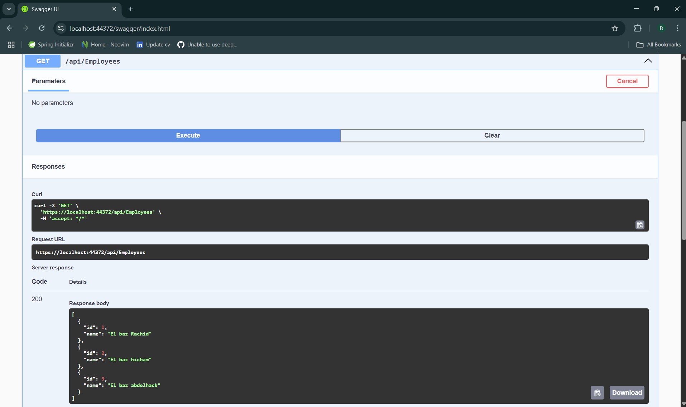
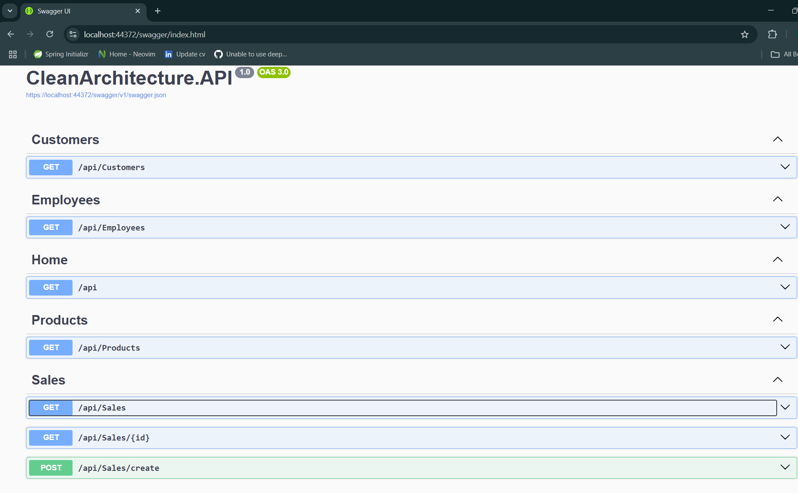
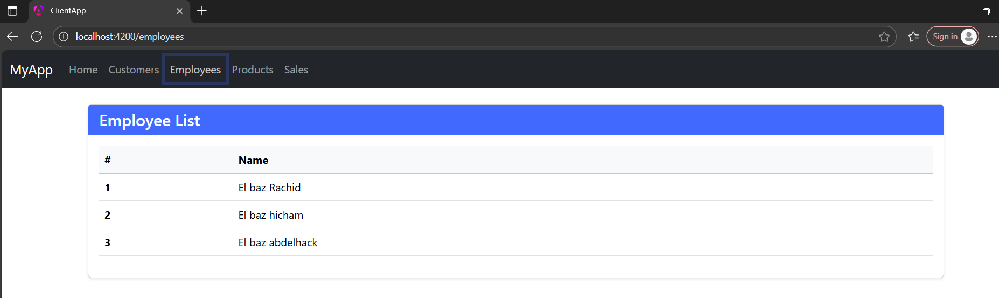

# Sales Management Application

## Project Overview

This is a small but realistic application built to demonstrate my professional skills in designing and implementing a **Clean Architecture** solution using:

- **Backend:** .NET 9 with layered architecture (Domain, Application, Infrastructure, API)  
- Implements **CQRS** pattern for commands and queries  
- Uses **Entity Framework Core** with migrations for data persistence  
- Applies **FluentValidation** for input validation  
- Implements basic domain events  
- Exposes **Swagger** documentation  

- **Frontend:** Angular 19 with TypeScript for a modern, responsive UI  
- Communicates with the backend API via HTTP services  
- Uses Bootstrap 5 for styling  

- **Testing:** Unit tests included for both backend and frontend layers  
- **Containerization:** Docker Compose orchestrates API, database

---


## Screenshots

### Server Side - Domain and Architecture  


### Server Side - API Endpoints (Swagger UI)  


### Client Application (Angular UI)  


---

## Setup Instructions

### Prerequisites

- Docker and Docker Compose installed on your machine  
- Git installed  

### Running the Application

1. Clone the repository:

   ```bash
   git clone https://github.com/rachidelbaz/FullStackCleanArchitecture.git
   cd sales-management-app
